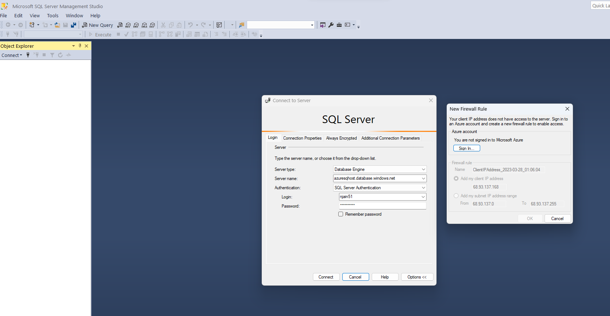
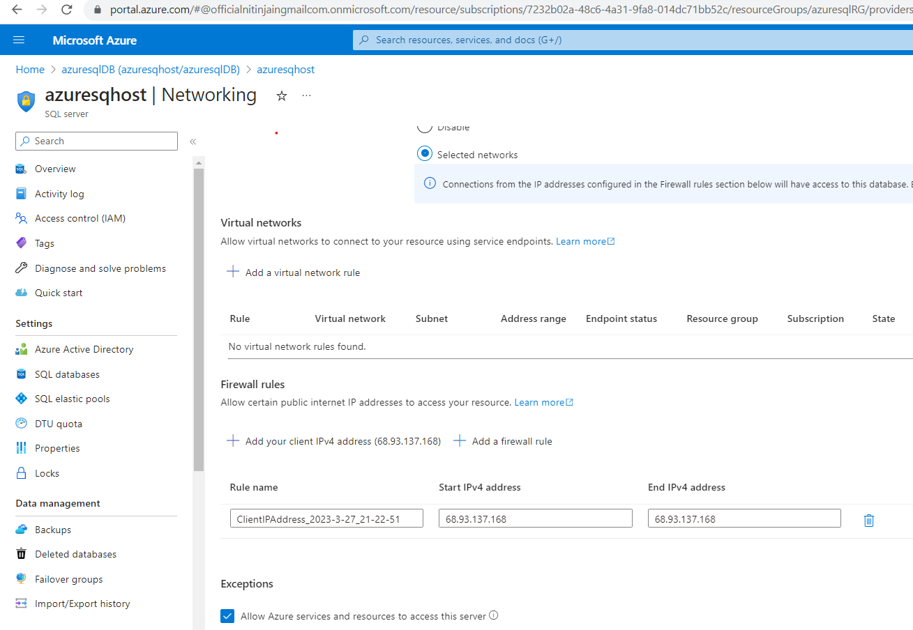
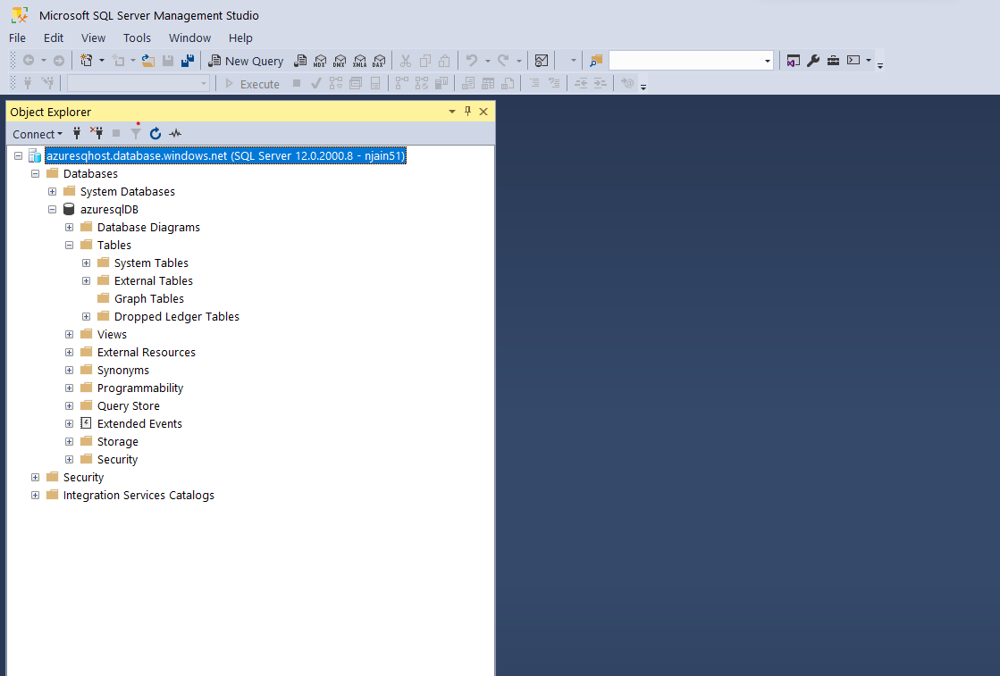

# Creating SQL server:

- go to azure portal
  - Marketplace -> Azure SQL -> Single Database -> Create
  - RG> azuresqlRG , name: azuresqlDB, 
  - server: azuresqhost, db credentials in .password file

- database creation done, here are the details:
  - server name: azuresqhost.database.windows.net
- database connection String
```text
Server=tcp:azuresqhost.database.windows.net,1433;Initial Catalog=azuresqlDB;Persist Security Info=False;User ID=njain51;Password={your_password};MultipleActiveResultSets=False;Encrypt=True;TrustServerCertificate=False;Connection Timeout=30;
```

- **note**:
  - alternatively we can also install local SQL server to connect with SSMS , check [here](https://www.sqlservertutorial.net/getting-started/install-sql-server-2017/)

## Connect to Azure SQL Database via SSMS
- [reference1](https://learn.microsoft.com/en-us/azure/azure-sql/database/connectivity-settings?view=azuresql&tabs=azure-portal#deny-public-network-access)

- 
- ensure you add firewall rule in portal 
- 
- then you will be able to connect to database
- 

