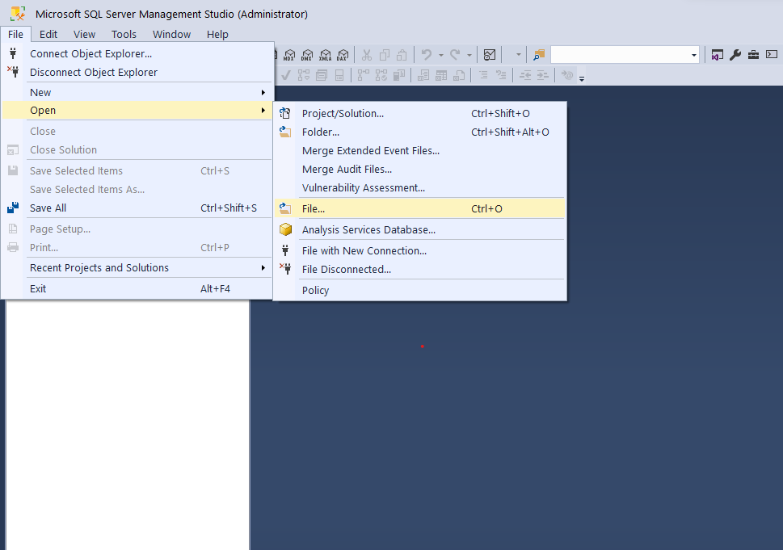
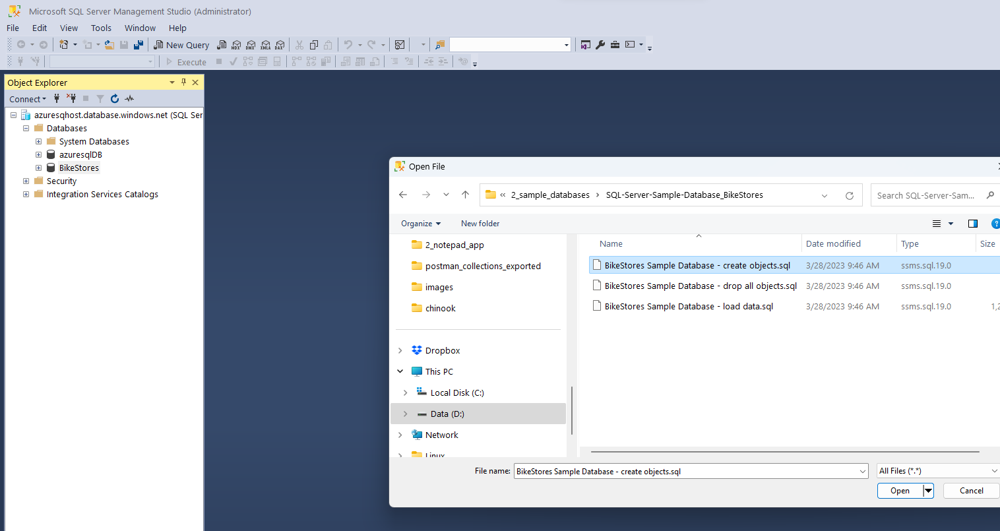
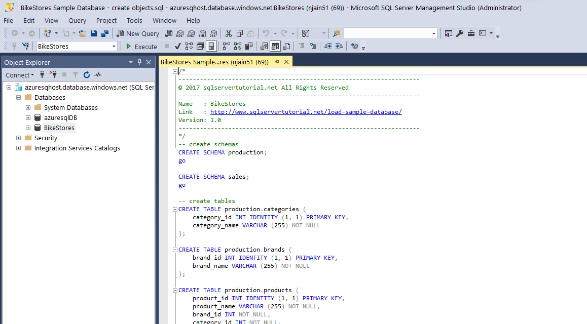
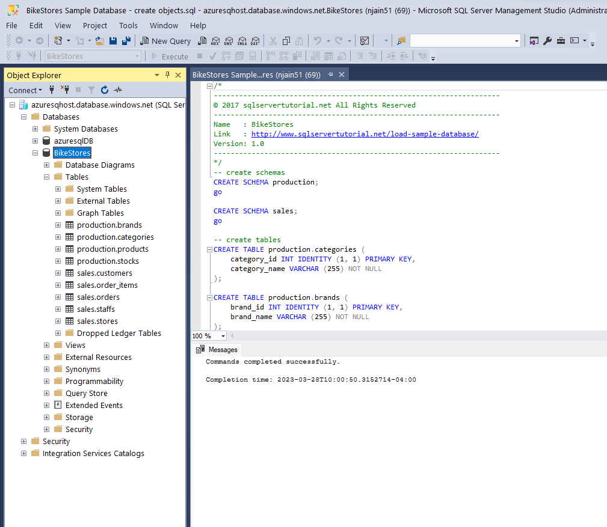
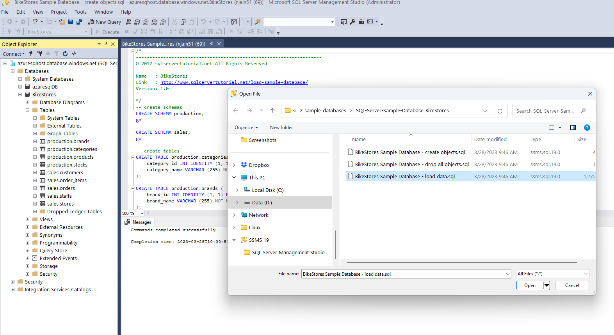
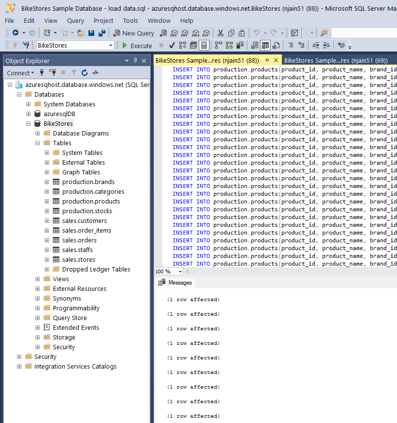

# Creating sample database

- Create empty Database Bikestore
  - right click Databases -> New Database
- [refer here](https://www.sqlservertutorial.net/load-sample-database/)
- [download sample database](https://www.sqlservertutorial.net/wp-content/uploads/SQL-Server-Sample-Database.zip)
- SSMS -> right Click Database -> BikeStores
- 
- 
- 
- 
- 
- 