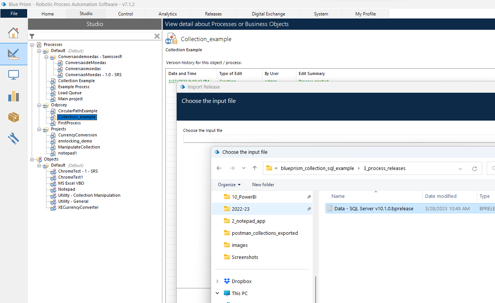

# BP Actions to Connect to SQL server

- Obtain VBO: Data -SQL Server from here - https://digitalexchange.blueprism.com/dx/entry/3439/solution/data---sql-server
- import release into BluePrism
- 
- Create new Action as follows and enter details
```text
azuresqhost.database.windows.net
BikeStores
njain51

```